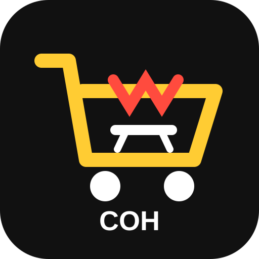

<!-- SWIR-README-STANDARD:v1 -->

<div align="center">
  

# CHECKOUT OF HELL

**SHIFT HAPPENS.**

A fast, readable comedy-horror retro FPS about surviving the worst supermarket night shift imaginable.

[](https://github.com/Swir/check-out-of-hell/actions/workflows/build.yml)


**Prototype 0.21-dev · 72% implemented/testable progress**

</div>

---

## ⚡ Overview

The store is closed. The lights are flickering. Self-checkouts are angry. Shopping carts are hunting staff. Management has decided this is somehow still your responsibility.

CHECKOUT OF HELL is an original comedy-horror retro FPS built around fast readable combat, creepy empty-store atmosphere, absurd workplace weapons, hostile retail equipment, real department objectives and an escalating **Overtime** system. The target is not merely to clear rooms: restore the store, survive management, and clock out alive at `06:00`.

The project creates its own setting, characters, weapons, jokes, levels, art, sound and music. **No proprietary Doom, Star Wars or other ripped commercial assets belong in this repository.**

## ✨ Highlights

- Fast classic-FPS combat with deliberate enemy tells and uncluttered encounter lanes.
- Real workplace objectives: breakers, powered routes, shutters, supervisor gates and a physical clock-out finish.
- Deterministic **Overtime** escalation that changes enemy pressure, alarms and environmental hazards without becoming random noise.
- Signature weapons: **Emergency Mop**, **Receipt Ripper**, **Price-Gun SMG** and **Turbo Can Launcher**.
- Signature threats: **Angry Self-Checkout**, **Cart of Doom**, **Security Price Scanner** and **Possessed Pallet Jack**.
- Corporate bosses: **Night Manager** and the two-phase **Regional Manager**.
- Optional Corporate Compliance Memos, Staff Only rewards, secrets and workplace-comedy interactions.
- Three authored difficulty modes that change resource/combat pressure while preserving objective and Overtime timing.
- Project-owned generated visual assets, combat audio and original department music.
- One-click Windows bootstrap that resolves required redistributable runtime files from official upstream sources.
- CI-built portable Windows development artifact with SHA-256 sidecar and pinned-engine parser validation.

## 🎮 Core shift loop

Every department is built around a real workplace objective rather than pure arena shooting:

1. enter the department,
2. restore, repair or activate something useful,
3. survive hostile store equipment and possessed retail hazards,
4. exploit optional powered routes, secrets and joke interactions,
5. defeat the department supervisor while Overtime escalates,
6. reach the required exit task and keep moving toward clocking out alive at `06:00`.

`MAP01 — Closing Time` currently implements the most complete version of this loop. Three Breaker Fuses pull the player through left, right and rear routes. At `2/3` power, a Staff Only side room opens. At `3/3`, a Full-Power Emergency Cache becomes available and the Night Manager enters the floor. Two management-response anchors then feed a readable Angry Self-Checkout → Cart of Doom → Security Price Scanner → Possessed Pallet Jack sequence at `15 / 34 / 54 / 76` seconds after full power. Once the supervisor is dead, fresh reinforcements stop and the player must physically return to the front checkout to clock out.

`MAP02 — Warehouse 13.5` requires all three breakers before The Regional Manager arrives. Breaker and supervisor-clearance tokens are department-local: a normal map transition clears them before the next department objective begins, while loading a save preserves serialized shift state.

## ⏱️ Overtime

Waiting is dangerous. Overtime escalates deterministically so the player can learn it:

| Time | State | Pressure |
| --- | --- | --- |
| `0:00–1:29` | SHIFT ACTIVE | base encounter |
| `1:30–2:59` | STORE UNSTABLE | warning layer + Angry Self-Checkout reinforcement pressure |
| `3:00–4:29` | OVERTIME | Cart of Doom pressure + active electrical floor hazards |
| `4:30+` | HELL RUSH | Possessed Pallet Jack pressure + faster hazard cadence |

Closing Time uses authored reinforcement and hazard anchors instead of random spawning on top of the player. Electrical hazards telegraph before dealing damage, and the front clock-out lane is protected from trap anchors.

## ☠️ Difficulty modes

Prototype `0.21-dev` includes three authored shift difficulties while keeping breaker gates, boss-wave timing and Overtime timing identical across all modes:

| Mode | Role | Tuning |
| --- | --- | --- |
| **Closing Crew** | forgiving first run | +25% ammo, -25% incoming damage, +20% healing, enemies at 90% health |
| **Graveyard Shift** | intended default | baseline ammo, damage, healing and enemy health |
| **Corporate Hell** | high-pressure replay | -15% ammo, +25% incoming damage, -15% healing, enemies at 115% health |

`Graveyard Shift` is the default. `Corporate Hell` requires explicit confirmation before clocking in. Difficulty changes combat forgiveness and resource pressure instead of hiding faster scripted traps or opaque respawn rules behind the selection.

## 🔊 Original soundtrack

Every currently playable department uses project-owned music instead of inherited base-game tracks:

- **Closing Time — Empty Aisles** — slow drones, sparse vibraphone phrases and checkout-like chimes that leave room for combat and Overtime telegraphs.
- **Warehouse 13.5 — Forklift Graveyard** — colder low-register drones, restrained machinery-like percussion and a darker warehouse motif.

The tracks are deterministic Standard MIDI files produced by `tools/generate_music_assets.py` using only Python's standard library. They are regenerated during every build, packaged under the PK3 `music/` namespace and protected by a dedicated regression contract.

See [`docs/MUSIC.md`](docs/MUSIC.md).

## 💾 Save/load state safety

The shift director distinguishes a fresh department from a savegame restore using GZDoom's `WorldEvent.IsSaveGame` state. Fresh departments clear only department-local Breaker Fuse and supervisor-clearance tokens before objective logic starts; save restores leave serialized director state intact. Supervisor kills also write the clearance token immediately, and the director can recover its cleared state from that token when loading older development saves.

A dedicated static/package contract verifies those invariants. A real pinned-GZDoom save → process exit → load runtime regression is being added before this milestone is considered demo-ready; the roadmap item stays open until that runtime test passes in CI.

## 🧰 Signature arsenal

- **Emergency Mop** — melee opener with original first-person animation and swing cue family.
- **Receipt Ripper** — paper-shredding shotgun analogue with original pickup/view animation and fire/cycle cues.
- **Price-Gun SMG** — automatic label weapon with barcode-label impact feedback.
- **Turbo Can Launcher** — heavy soda-can launcher with an original projectile and explosion presentation.

See [`docs/WEAPONS.md`](docs/WEAPONS.md).

## 👹 Signature threats

- **Angry Self-Checkout**
- **Cart of Doom**
- **Security Price Scanner**
- **Possessed Pallet Jack**
- **Night Manager**
- **The Regional Manager**

All current signature weapons, enemies and bosses use project-owned visible combat presentation and project-owned combat-audio families. High-repeat sounds are selected from deterministic generated variation families so combat stays recognizable without repeating one identical sample every time.

## 🛒 Closing Time presentation

The current vertical-slice work includes:

- original supermarket wall, shelf, floor, ceiling and Staff Only surfaces,
- Customer Service, Frozen Foods, Electronics/Returns and Lane 06 signage,
- low-profile retail clutter that does not block combat lanes,
- animated failing fluorescent fixtures,
- optional Emergency Break Snacks,
- three Corporate Compliance Memos with workplace-comedy messages,
- project-owned breaker, shutter, stash, memo and Overtime hazard sprites,
- a compact final-layout HUD with objective/route hierarchy, `06:00` target, Overtime pressure, worker health and signature-ammo reserves,
- text/pattern state cues in addition to color for critical HUD information,
- a guaranteed full-power recovery cache before the Night Manager encounter,
- post-supervisor cutoff for new reinforcements so the clock-out leg remains tense without becoming an endless spawn treadmill,
- a project-owned map-specific ambient soundtrack designed not to mask gameplay cues.

Project-owned runtime art, audio and MIDI music are generated deterministically from repository code using Python's standard library. CI checks generated assets, mappings, actor wiring, music structure and packaged PK3 contents.

## 🚀 Quick Start — Windows

**Players should never need to hunt for required runtime files manually.**

From a source checkout, double-click:

```text
PLAY.bat
```

The launcher automatically:

1. reads pinned versions from `runtime-lock.json`,
2. resolves GZDoom from the official `ZDoom/gzdoom` GitHub Release,
3. resolves Freedoom from the official `freedoom/freedoom` GitHub Release,
4. verifies Freedoom SHA-256 against its official checksum when available,
5. downloads an official portable Python build from `python.org` only when a source build needs Python and none is installed,
6. builds and smoke-tests the PK3 when necessary,
7. launches the game.

Downloaded runtime files are cached locally. Network or verification failures stop with clear actionable errors; the project does not silently fall back to unofficial mirrors.

See [`docs/THIRD_PARTY.md`](docs/THIRD_PARTY.md) and [`docs/PACKAGING.md`](docs/PACKAGING.md).

## 📦 Portable Windows development artifact

CI builds and verifies `CHECKOUT-OF-HELL-Windows-Portable-dev.zip`. It contains the prebuilt PK3, a dedicated `PLAY.bat`, runtime lock, official-source bootstrap and license notices. No Python or source build toolchain is required on the player's PC. First launch obtains only missing pinned redistributable runtime dependencies from official upstream sources. A SHA-256 sidecar is generated and validated in CI.

This is intentionally a **development artifact, not a public demo release**.

## ✅ What already works

- buildable PK3 prototype,
- structured `Closing Time` and power-gated `Warehouse 13.5`,
- three-breaker objective loop and physical clock-out finish,
- department-local objective reset without destroying save-restored shift state,
- Overtime reinforcement director plus telegraphed environmental hazards,
- tuned Night Manager management-response sequence,
- powered Staff Only optional route and exploration rewards,
- Corporate Compliance Memo scavenger route,
- final-layout night-shift HUD,
- three authored difficulty modes,
- original presentation for four signature weapons and all current signature enemies/bosses,
- deterministic stdlib-only visual/audio/music generation,
- randomized combat-audio families with PCM/headroom regression coverage,
- original department soundtrack for MAP01 and MAP02 with deterministic MIDI validation,
- one-click official-source dependency bootstrap,
- verified portable Windows artifact builder with SHA-256 sidecar,
- pinned GZDoom runtime parser/startup validation on Windows CI,
- save/load state static/package regression contract,
- custom CHECKOUT OF HELL branding/icon.

## 🖥️ Requirements & compatibility

The current pinned development/runtime stack is:

| Component | Pinned target |
| --- | --- |
| GZDoom | `g4.14.2` |
| Freedoom | `v0.13.0` |
| Build/bootstrap Python | `3.12.10` portable fallback |
| Player packaging focus | Windows portable/source bootstrap |

Runtime pins live in `runtime-lock.json` and should only change after compatibility validation. The repository does **not** claim a public demo, installer or polished final-game support yet.

## 🧪 Development & validation

CI downloads the pinned official runtime and asks GZDoom itself to load and parse the current PK3 through its non-interactive `-norun` startup path. This catches engine-level MAPINFO/ZScript/package errors that static Python checks cannot detect.

Manual developer commands:

```powershell
python tools/build.py
python tools/smoke_test.py
python tools/test_gameplay_contract.py
python tools/test_difficulty_modes_contract.py
python tools/test_save_load_state_contract.py
python tools/test_runtime_save_load_smoke_contract.py
python tools/test_closing_time_layout.py
python tools/test_staff_room_contract.py
python tools/test_closing_time_presentation_contract.py
python tools/test_environment_polish_contract.py
python tools/test_closing_time_pacing_contract.py
python tools/test_hud_contract.py
python tools/test_overtime_hazard_contract.py
python tools/test_boss_escape_contract.py
python tools/test_original_assets.py
python tools/test_combat_audio_polish.py
python tools/test_music_contract.py
python tools/test_vehicle_enemy_assets.py
python tools/test_regional_manager_contract.py
python tools/test_bootstrap_contract.py
python tools/package_portable.py
python tools/test_portable_package.py
.\tools\gzdoom_runtime_smoke.ps1
```

The automated Linux job runs static/build/package contracts. The Windows job resolves the official pinned runtime and validates the packaged prototype with GZDoom itself.

## 🗺️ Maps

- `MAP01` — **Closing Time** — structured objective slice with original retail surfaces, department signage, optional powered exploration, staged Overtime floor hazards, tuned supervisor response, original ambient music and physical clock-out escape.
- `MAP02` — **Warehouse 13.5** — power-restoration arena with original retail surfaces, original ambient music and a gated two-phase Regional Manager boss; department-local objective tokens reset before its breaker loop begins.
- Planned departments include **Frozen Foods**, **Electronics**, **Customer Service** and **Management Floor**, but they will only be expanded when there is real playable content.

See [`docs/LEVEL_DESIGN.md`](docs/LEVEL_DESIGN.md) and [`docs/GAMEPLAY_LOOP.md`](docs/GAMEPLAY_LOOP.md).

## 🧱 Technology & architecture

- **GZDoom / ZScript** — runtime gameplay, HUD, bosses, objective state and encounter direction.
- **UDMF** — authored department geometry and gameplay layers.
- **PK3** — game package format.
- **Python 3** — deterministic original asset/music generation, build tooling and regression contracts.
- **PowerShell / Batch** — Windows bootstrap, pinned runtime validation and one-click launch flow.
- **GitHub Actions** — Linux contracts plus pinned Windows GZDoom validation and portable artifact builds.

## ⚖️ Asset & distribution policy

No proprietary Doom, Star Wars or other commercial game assets are committed. The current runtime art/audio/music pack is generated from original repository source. Compatible legal engine/base-game data is obtained from upstream at setup time rather than copied into the project.

For a public demo, the preferred package is fully self-contained where licenses permit redistribution. Otherwise first run must automatically obtain every missing redistributable dependency from official upstream sources so a normal Windows player never has to search for files manually.

See [`docs/ASSET_POLICY.md`](docs/ASSET_POLICY.md) and [`docs/THIRD_PARTY.md`](docs/THIRD_PARTY.md).

## 🧭 Roadmap & releases

- Project roadmap: [`ROADMAP.md`](ROADMAP.md)
- Changelog: [`CHANGELOG.md`](CHANGELOG.md)
- GitHub Releases: [releases](https://github.com/Swir/check-out-of-hell/releases)

**Public demo rule:** no demo release until the project is genuinely presentable, fun enough to represent the final direction and one-click for a normal Windows player. Current portable packages are development artifacts only.

## ⚠️ Current limitations

- `Closing Time` is not yet signed off as the first fully polished level.
- `Warehouse 13.5` is playable but not yet fully polished.
- Full runtime save/load validation is still a demo-readiness gate until the real pinned-engine round-trip test passes CI.
- Controller, accessibility-option and performance passes for the public demo are not complete.
- Frozen Foods, Electronics, Customer Service and Management Floor remain planned until they have real playable content.

## 🔎 Search Keywords

`retro FPS` · `comedy horror FPS` · `supermarket horror game` · `workplace horror game` · `retail horror` · `boomer shooter` · `GZDoom game` · `GZDoom ZScript` · `UDMF FPS` · `PK3 game` · `Windows retro shooter` · `Overtime mechanic` · `original GZDoom project` · `one-click Windows bootstrap` · `Freedoom runtime` · `night shift horror`

---

<div align="center">

**CHECKOUT OF HELL** · by **Swir**  
[GitHub profile](https://github.com/Swir) · [Repository](https://github.com/Swir/check-out-of-hell)

*Original retail nightmare. No ripped commercial game assets.*

</div>
