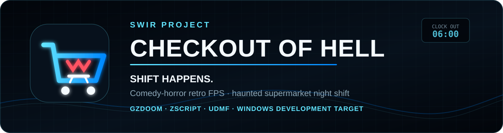
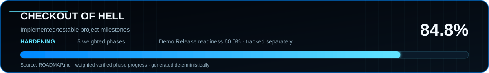

<!-- SWIR-README-STANDARD:v2 -->

<div align="center">



<br>

[](https://github.com/Swir/check-out-of-hell/actions/workflows/build.yml)


**A fast, readable comedy-horror retro FPS about surviving the worst supermarket night shift imaginable.**

[**Highlights**](#-highlights) · [**Quick Start**](#-quick-start--windows) · [**Roadmap**](#-roadmap--releases) · [**Releases**](https://github.com/Swir/check-out-of-hell/releases)

</div>

## 📌 Project status

| Item | Status |
| --- | --- |
| Current stage | Prototype / vertical-slice development |
| Version | `0.36.0-dev` |
| Implemented/testable progress | **86.8%** |
| Playable departments | `MAP01 — Closing Time`, `MAP02 — Warehouse 13.5`, `MAP03 — Frozen Foods`, `MAP04 — Electronics`, `MAP05 — Customer Service`, `MAP06 — Management Floor` |
| Public demo | **Not published yet** |
| Player packaging focus | Verified Windows RC + standalone legal-content RC + one-click official-source GZDoom bootstrap |
| Pinned runtime | GZDoom `g4.14.2` + Freedoom `v0.13.0` |



**Progress fallback:** **86.8%** implemented/testable project progress across **5 weighted roadmap phases**. **Demo Release readiness: 70.0%**, tracked separately.

Progress is based only on implemented and testable work. See [`ROADMAP.md`](ROADMAP.md) for the authoritative weighted milestone breakdown and separate release-readiness gate.

## ⚡ Overview

The store is closed. The lights are flickering. Self-checkouts are angry. Shopping carts are hunting staff. Management has decided this is somehow still your responsibility.

**CHECKOUT OF HELL** is an original comedy-horror retro FPS built around fast readable combat, a creepy empty-store atmosphere played mostly straight, absurd workplace weapons, hostile retail equipment, real department objectives and an escalating **Overtime** system. The objective is not merely to clear rooms: restore the store, survive management and clock out alive at `06:00`.

The project creates its own setting, characters, weapons, jokes, levels, art, sound and music. **No proprietary Doom, Star Wars or other ripped commercial assets belong in this repository.**

## ✨ Highlights

| Feature | What it adds |
| --- | --- |
| ⚡ Fast readable combat | Clear attacks, uncluttered lanes and classic-FPS movement pressure. |
| 🛠️ Real shift objectives | Breakers, compressor resets, network reboots, refund authorization, boardroom review, powered routes, shutters, freight-lift controls, supervisor gates and a physical clock-out finish. |
| ⏱️ Overtime | Deterministic escalation adds alarms, enemy pressure and telegraphed electrical/refrigeration/display-bank/moving-equipment/executive-audit hazards, with useful store systems able to change the physical risk without becoming a combat-off switch. |
| 🧰 Retail arsenal | Emergency Mop, Receipt Ripper, Price-Gun SMG and Turbo Can Launcher use original presentation and audio. |
| 👹 Store hazards | Angry Self-Checkout, Cart of Doom, Security Price Scanner and Possessed Pallet Jack fill distinct combat roles. |
| 👔 Corporate bosses | Night Manager, the two-phase Regional Manager and the first-pass District Director turn management into literal boss fights; Customer Service adds the Returns Policy Enforcer as a department miniboss. |
| 🔎 Optional discoveries | Staff Only rewards, Corporate Compliance Memos, damaged-goods supplies, an elevated warehouse overstock route, a hidden Staff Room and workplace-comedy side tasks reward exploration. |
| ☠️ Authored difficulty | Closing Crew, Graveyard Shift and Corporate Hell tune resources and damage without hiding faster scripted hazards. |
| ♿ Readability options | Optional focus HUD and large textual warnings reinforce objectives, pressure and critical-health states without changing combat rules. |
| 🎮 Controller setup | A dedicated menu exposes core remaps, engine device/stick setup and restrained signature-weapon haptics without overwriting player bindings. |
| ⚙️ Performance hardening | Sparse objective/wave polling and self-retiring one-shot watchers reduce script overhead without retiming authored encounters. |
| 🔊 Original presentation | Project-owned generated art, combat audio and department music; no ripped commercial game assets. |
| 📦 Verified Windows candidate | CI builds a prebuilt Python-free portable candidate with local SHA-256 manifest verification, verified bundled Freedoom content and official-source GZDoom bootstrap. |
| ⚖️ Verified legal-content layer | A separate deterministic content-only RC carries the exact project/Freedoom payload, notices, provenance and source-bound SHA-256 manifest without redistributing the engine. |
| 🔗 One-click runtime setup | Missing redistributable runtime files are resolved from official upstream sources instead of making players hunt for them. |

## 🎮 Core shift loop

Every department is designed around a useful workplace task rather than pure arena shooting:

1. enter the department,
2. restore, repair or activate something useful,
3. survive hostile store equipment and possessed retail hazards,
4. exploit optional powered routes, secrets and joke interactions,
5. defeat the department supervisor while Overtime escalates,
6. finish the exit task and keep moving toward clocking out alive at `06:00`.

`MAP01 — Closing Time` currently implements the most complete version of this loop. Three Breaker Fuses pull the player through left, right and rear routes. At `2/3` power, a Staff Only side room opens. At `3/3`, a Full-Power Emergency Cache becomes available and the Night Manager enters the floor. Two management-response anchors then feed a readable Angry Self-Checkout → Cart of Doom → Security Price Scanner → Possessed Pallet Jack sequence at `15 / 34 / 54 / 76` seconds after full power. Once the supervisor is dead, fresh reinforcements and newly spawned Overtime floor hazards stop, an original `CLOCK OUT` guide appears near the front lanes, and the player must physically return to the existing checkout trigger to finish the shift.

`MAP02 — Warehouse 13.5` has its own department loop instead of sharing MAP01's boss gate verbatim. The player restores three loading-bay circuits, then chooses whether to detour for optional full-power recovery and Lockout/Tagout safety tasks before engaging the project-owned Freight Lift Override at the rear bay. A ten-step west-wall Staff-Only Overstock Catwalk adds an elevated route outside the moving-pallet lanes, and a hidden Staff Room reached from the catwalk can be opened from the floor by destroying a project-owned stock pile to create a shortcut to optional health/label rewards; no breaker, lift control, boss anchor or safety state is hidden there. The safety permit retires future Warehouse electrical floor arcs only; ambient hostile Overtime and moving pallet traffic remain active. At deep Overtime, two warned outer-lane Runaway Restock Pallets activate only after at least two circuits are live: west/east starts are staggered at `12 / 27` seconds, every launch is telegraphed for two seconds and repeat spacing tightens from `30` to `22` seconds while the central `x=-180..180` objective/clock-out corridor remains permanently open. Engaging the lift arms a four-second visual/audio Regional Manager arrival warning, starts the rear-flank Security Price Scanner → Possessed Pallet Jack → Cart of Doom management response at `12 / 30 / 52` seconds and only then lets Regional Management enter the floor. Supervisor clearance retires future pallet launches and the HUD plus project-owned `CLOCK OUT` guide send the player back to the warehouse entry. Breaker, warehouse, lift, safety and supervisor-clearance state is department-local on fresh transitions while savegame restores preserve current shift state.

`MAP03 — Frozen Foods` is now a real playable department rather than a roadmap placeholder. Four freezer-aisle barriers keep a readable central service lane while two cold-chain breaker repairs pull the player through opposite side routes. Each repair telegraphs a dedicated right-flank response; after the second breaker, a project-owned **Cold-Chain Compressor Reset** appears at the rear service position and physically supplies the final `3/3` power step. Full power exposes the recovery cache and existing Night Manager/management-wave response without stacking another instant side-lane enemy. If Overtime is already active, the reset compressor can begin telegraphed right-flank refrigerant surges; an optional opposite-side **Compressor Surge Isolation** control suppresses those future bursts only, leaving hostile Overtime and management active. Four standard side-lane Overtime hazard anchors still make long freezer shifts physically more dangerous without trapping the entry/clock-out route. Three optional Corporate Compliance Memos, project-owned Frozen Foods signage, cold-storage clutter and the original `Compressor Choir` theme give the department its own identity. After supervisor clearance, surge pressure retires and the existing physical clock-out rule sends the player back to the entry.

`MAP04 — Electronics` is a real playable fourth department. Alternating solid display-wall rows break up long showroom sightlines while preserving a clear central service lane. Two opposite-side UPS/breaker repairs each trigger a three-second flank warning before a Security Price Scanner and Angry Self-Checkout response. After both repairs, a project-owned **Store Network Reboot** appears at the rear service position. Using it starts a ten-second hold-the-department sequence: a Scanner answers at 2 seconds, another warning lands at 5 seconds, a Cart of Doom enters at 7 seconds, and only the completed cycle supplies the final authoritative `3/3` power step. Full power can also arm a telegraphed right-side demo-wall surge once Overtime is active, while an optional opposite-side **Demo Wall Kill Switch** suppresses only that display-bank hazard. At deeper Overtime, a separate warned five-second security shutter can temporarily close one inner aisle while leaving the central service/clock-out lane open; Hell Rush shortens its recurrence, and supervisor clearance retires future locks. The department now has dedicated HUD text for showroom circuits, network reboot, Night Manager clearance and the return-to-entry leg.

`MAP05 — Customer Service` is now playable development content with its own workplace task. The player traverses a serpentine queue to restore two service-desk circuits. At `2/3`, a physical **Refund Authorization Terminal** appears at the rear desk; using it starts a save-safe twelve-second Corporate verification hold instead of handing out the last power token immediately. An Angry Self-Checkout enters at 2 seconds, warnings land at 5 and 9 seconds, a Security Price Scanner answers at 7 seconds and the **Returns Policy Enforcer** arrives at 10 seconds with a readable three-way Corporate Red Tape volley. Surviving to 12 seconds grants the same authoritative final `CheckoutFuse` token used by the hardened `3/3` Night Manager and clock-out gates. Separately, Overtime can activate a warned complaint-queue caller after a 20-second grace period; its deterministic `38 / 30 / 22` second cadence escalates from Self-Checkout to Scanner to Cart as pressure rises. An optional opposite-side **Take-A-Number Queue Reset** suppresses only those future complaint calls, leaving standard Overtime and management active. The pressure enters from authored outer queue lanes so the central return route remains readable, while optional Corporate Compliance Memos and the stash remain side content.

`MAP06 — Management Floor` is now playable development content built around paired executive-office wings and a permanently open central route. Two opposite-side **Executive Access circuits** open the rear boardroom shutters at `2/3`; the physical **Boardroom Breaker Authorization** then starts a save-safe ten-second review rather than granting the last power token immediately. A Scanner enters at 4 seconds, a second warning lands at 7 seconds, an Angry Self-Checkout enters at 9 seconds and only the 10-second completion supplies the authoritative final `CheckoutFuse`. Full authorization then arms a separate four-second arrival warning before **The District Director** enters. The department's deep-Overtime **Executive Audit** waits until both circuits are live and Overtime reaches stage 2, warns for two seconds and answers with Scanner/Cart pressure on deterministic `32 / 22` second spacing; the fixed Boardroom Review pauses that recurring pressure and leaves eight seconds of recovery afterward. Supervisor clearance uses the shared post-boss state and the player returns through the center corridor to the front clock-out trigger.

## ⏱️ Overtime

Overtime is deterministic enough to learn while still raising pressure:

| Time | State | Pressure |
| --- | --- | --- |
| `0:00–1:29` | SHIFT ACTIVE | Base encounter |
| `1:30–2:59` | STORE UNSTABLE | Warning layer + Angry Self-Checkout reinforcement pressure |
| `3:00–4:29` | OVERTIME | Cart of Doom pressure + active electrical floor hazards |
| `4:30+` | HELL RUSH | Possessed Pallet Jack pressure + faster hazard cadence |

Closing Time uses authored reinforcement and hazard anchors instead of random spawning on top of the player. Electrical hazards telegraph before dealing damage, and the front clock-out lane is protected from trap anchors. The authored warning/arc schedule remains unchanged, but the hazard anchors retire when supervisor clearance is earned so no fresh electrical trap appears during the deliberate return-to-checkout leg; enemies already alive remain part of the escape pressure.

Warehouse 13.5 reuses the same readable warning/arc schedule at two outer side-lane anchors. Once all three warehouse circuits are live, an optional project-owned `LOCKOUT / TAG OUT` station appears on the rear-left side lane. Collecting its permit removes those future electrical floor-arc anchors for that department only; it deliberately does **not** stop ambient Overtime enemies, management-response waves, the freight-lift objective, The Regional Manager or the separate moving-pallet system. After at least two circuits are live and Overtime reaches stage 2, two pallet lanes at `x=-300` and `x=300` arm on staggered `12 / 27` second starts. Every run receives a two-second warning, Stage 2 repeats at `30` seconds per lane, Hell Rush tightens that to `22`, and the central `x=-180..180` route stays clear. Supervisor clearance retires both pallet spawners before the final return.

Frozen Foods keeps four authored electrical hazard anchors in the freezer side lanes and rear aisle, away from the entry/clock-out approach. Full power also arms one department-specific right-flank compressor vent once Overtime is active: the first surge waits 18 seconds, every burst receives a two-second warning, and repeat spacing tightens from `34` to `26` to `20` seconds as pressure rises. The optional full-power **Compressor Surge Isolation** control on the opposite side lane retires only this refrigeration hazard; enemy Overtime, management waves and the Night Manager continue normally. Supervisor clearance cancels any armed surge before the return-to-entry leg.

Electronics keeps three standard electrical hazard anchors on outer showroom lanes and a separate full-power right-side demo-wall surge. Once Overtime is active, the first display fault waits 16 seconds, every burst receives a two-second warning, and repeat spacing tightens from `32` to `24` to `18` seconds as pressure rises. The optional full-power **Demo Wall Kill Switch** sits on the opposite side of the floor and retires only this Electronics-specific surge; hostile Overtime, standard floor arcs, management waves and the Night Manager remain active. At Overtime stage 2+, a separate two-second warning can precede a five-second security-shutter lockdown on one inner-left aisle. The central service lane never closes, the kill switch does not disable this management lockdown, and Hell Rush tightens recurrence from 24 to 18 seconds after the initial delay. Supervisor clearance retires both department-specific spawners before the final return.

Customer Service keeps the fixed Refund Authorization defence separate from its department-specific Overtime caller. The audit remains a readable `2 / 7 / 10` second sequence, with the Returns Policy Enforcer as the final 10-second response and the last power token only at 12 seconds. Once at least one desk circuit is live and Overtime has started, an outer queue lane waits 20 seconds, warns for two seconds and then calls an extra hostile customer on deterministic `38 / 30 / 22` second stage-scaled spacing. The refund audit pauses this complaint layer and leaves an eight-second recovery window afterward. The optional **Take-A-Number Queue Reset** disables only future complaint calls; standard Overtime, floor hazards, management and the Night Manager remain active.

Management Floor keeps its fixed ten-second Boardroom Review separate from the recurring Executive Audit. Once both Executive Access circuits are live and Overtime reaches stage 2, an outer-right office lane waits 16 seconds, warns for two seconds and then answers with a Security Price Scanner; Hell Rush upgrades that answer to a Cart of Doom. Repeat spacing is deterministic at `32 / 22` seconds. Starting the Boardroom Review cancels any armed audit warning, pauses the recurring layer for the full review and leaves eight seconds of recovery afterward. The permanent central boardroom/clock-out corridor remains open, and supervisor clearance retires future audits.

## ☠️ Difficulty modes

| Mode | Role | Tuning |
| --- | --- | --- |
| **Closing Crew** | Forgiving first run | +25% ammo, -25% incoming damage, +20% healing, enemies at 90% health |
| **Graveyard Shift** | Intended default | Baseline ammo, damage, healing and enemy health |
| **Corporate Hell** | High-pressure replay | -15% ammo, +25% incoming damage, -15% healing, enemies at 115% health |

Breaker gates, Night Manager wave timing and Overtime timing remain identical across all three modes. `Corporate Hell` requires explicit confirmation before clocking in.

## 🧰 Signature arsenal & threats

**Weapons:** Emergency Mop · Receipt Ripper · Price-Gun SMG · Turbo Can Launcher  
**Store hazards:** Angry Self-Checkout · Cart of Doom · Security Price Scanner · Possessed Pallet Jack  
**Corporate threats:** Night Manager · The Regional Manager · The District Director (Management Floor prototype boss) · Returns Policy Enforcer (Customer Service miniboss)

All current signature weapons, enemies and bosses use project-owned visible combat presentation and project-owned combat-audio families. High-repeat sounds use deterministic generated variation families so combat stays recognizable without repeating one identical sample every time.

See [`docs/WEAPONS.md`](docs/WEAPONS.md).

## 🛒 Current playable content

### MAP01 — Closing Time

The current vertical-slice level includes original supermarket surfaces and signage, Customer Service / Frozen Foods / Electronics identity, safe retail clutter, failing fluorescent fixtures, optional Emergency Break Snacks, three Corporate Compliance Memos, three off-route resource stashes with workplace-comedy pickup interactions, a final-layout night-shift HUD, a full-power recovery cache, staged Overtime floor hazards, a tuned Night Manager response and a physical return-to-checkout finish. The post-boss leg now suppresses fresh reinforcements and electrical hazards and exposes a project-owned `CLOCK OUT` guide at the front approach without changing the completion zone itself.

The secret pass keeps progression readable: the Unclaimed Receipt Roll, Damaged-Goods Label Crate and Unauthorized Employee Relief Kit sit in dead-end retail corners away from the central combat/clock-out lane. They reward exploration with receipts, labels or health but never gate a breaker, boss or exit objective.

### MAP02 — Warehouse 13.5

The warehouse slice uses project-owned retail surfaces, freight/loading-bay signage and an original soundtrack. Restoring all three breakers powers a visible Freight Lift Override at the rear bay, an optional recovery cache and a dedicated `LOCKOUT / TAG OUT` safety sign on the opposite side lane. The right-side Damaged Goods cage lets the player spend ammunition breaking project-owned stock piles for optional supplies. A ten-step Staff-Only Overstock Catwalk along the west wall creates an elevated side route outside the moving-pallet lanes; it threads through a hidden Staff Room whose shootable south stock-pile entrance can be opened from floor level to create a shortcut and expose optional health/label rewards without hiding any mandatory objective. Taking the safety permit stops future warehouse electrical floor arcs without disabling enemy Overtime or moving pallet traffic. At deep Overtime, two outer pallet lanes activate only after at least two circuits are live, telegraph each pass for two seconds, stagger their first launches at `12 / 27` seconds and repeat at `30 / 22` seconds while the central objective/clock-out corridor remains open. Engaging the lift now telegraphs Regional Management for four seconds with project-owned visual/audio warning before The Regional Manager enters; the authored `12 / 30 / 52` rear-flank management response remains intact. Warehouse-specific HUD and Focus HUD text track breakers, lift state, Regional Management and the return-to-entry leg; supervisor clearance retires the pallet lanes and a post-clear `CLOCK OUT` guide improves the final return route. Warehouse 13.5 remains playable development content, not a polished final level.

### MAP03 — Frozen Foods

Frozen Foods now ships as playable development content. The map uses four freezer-aisle barriers to create alternating cold-storage routes around a readable central lane, two mandatory breaker circuits, a two-breaker-gated rear **Cold-Chain Compressor Reset** that supplies the final power token, a full-power recovery cache, a power-gated Night Manager, a staged management-response anchor, four environmental Overtime hazard points and a post-clear return guide. Each breaker repair first telegraphs the right freezer flank for three seconds, then answers with a Security Price Scanner and a Cart of Doom respectively; the compressor transition deliberately adds no third instant side-lane enemy. Once full power and Overtime overlap, a separate right-side compressor-surge anchor waits 18 seconds, warns for two seconds and emits a short refrigerant burst on a deterministic pressure-scaled cadence. A project-owned **Compressor Surge Isolation** control appears on the opposite side lane at full power and lets the player disable only those future bursts without switching off hostile Overtime or management pressure. Initial pressure stays off the entry centerline, while three optional Corporate Compliance Memos and two Emergency Break Snacks reward side exploration. The map-local memo initializer clears only progress carried into a fresh MAP03 and destroys itself, so saves made after entering Frozen Foods keep memo progress normally.

The compressor reset, surge isolation panel and refrigerant burst frames use deterministic project-owned sprites generated during the normal build. The department also uses paired project-owned `FROZEN FOODS` signs, safe restock/cone clutter, slow-failing lights and the original **Frozen Foods — Compressor Choir** MIDI track. This is a first playable vertical-slice implementation, not a claim that the level is fully polished.

### MAP04 — Electronics

Electronics now ships as playable development content. Four alternating solid display-wall rows create changing showroom sightlines around a clear central service lane. Two mandatory opposite-side circuit repairs feed a three-second telegraphed Scanner/Self-Checkout response; after both are live, the rear **Store Network Reboot** appears. Physical interaction starts a ten-second defence instead of handing out the last power token immediately: a Scanner arrives at 2 seconds, the next warning lands at 5, a Cart of Doom arrives at 7, and successful completion at 10 seconds grants the final `3/3` state. The HUD now describes those exact states rather than falling back to generic breaker language. Full power exposes the normal recovery cache and power-gated Night Manager/management response, plus one optional opposite-side **Demo Wall Kill Switch**. A separate right-side display surge activates only when full power and Overtime overlap, waits 16 seconds before the first possible fault, warns for two seconds and repeats on deterministic `32 / 24 / 18` second stage-scaled spacing. At deeper Overtime, a separate warned five-second shutter can temporarily block one inner display aisle without touching the central lane; Hell Rush accelerates recurrence and supervisor clearance ends future locks. The kill switch suppresses only display faults, leaving hostile Overtime, standard electrical floor hazards, the shutter system and management active.

Three optional Corporate Compliance Memos and two Emergency Break Snacks reward side exploration without hiding mandatory power work. The fresh-entry initializer clears carried memo/kill-switch/reboot state, waits for the shared fresh-world cleanup, grants an invisible Electronics department marker for truthful HUD routing, and then destroys itself; ordinary saves made after entering MAP04 preserve local progress. The network-reboot, kill-switch and display-surge frames are deterministic project-owned sprites generated during the normal build, paired with existing project-owned Electronics signage and the original **Electronics — Dead Pixel Choir** MIDI track. Electronics is a first playable department implementation, not a polished final level.

### MAP05 — Customer Service

Customer Service now ships as playable development content rather than a roadmap-only placeholder. A long serpentine queue shapes sightlines and movement around a readable service route. Two mandatory service-desk circuit repairs pull the player across opposite queue lanes; after both are live, the rear **Refund Authorization Terminal** appears. Using it starts a twelve-second Corporate verification hold: Angry Self-Checkout pressure at 2 seconds, a warning at 5, Security Price Scanner pressure at 7, another warning at 9 and the **Returns Policy Enforcer** at 10 seconds. The 220-health Enforcer reuses project-owned Self-Checkout presentation but changes the fight with a readable three-way Corporate Red Tape volley; it never owns progression state. Only surviving through 12 seconds supplies the final authoritative `3/3` power state, after which the shared full-power cache, Night Manager and physical return-to-entry clock-out systems continue normally.

Customer Service also owns a separate complaint-queue Overtime layer. Once at least one desk circuit is live, Overtime can arm an outer queue caller after a 20-second grace period; every call warns for two seconds, then escalates from Angry Self-Checkout to Scanner to Cart on deterministic `38 / 30 / 22` second spacing. The refund audit pauses those calls and grants eight seconds of recovery afterward. An optional opposite-side **Take-A-Number Queue Reset** retires only future complaint calls while global Overtime, floor hazards and management stay active. Three optional Corporate Compliance Memos and the existing stash reward exploration without gating progression. Customer Service still reuses shared project-owned retail presentation, but has its own deterministic original **Customer Service — Please Hold Forever** MIDI theme. This is a first playable department implementation, not a polished final level.

### MAP06 — Management Floor

Management Floor now ships as playable development content instead of a roadmap-only placeholder. Paired executive-office wings flank a permanently open central route, with two opposite-side Executive Access circuits driving the player across the floor. Restoring both circuits opens the powered rear boardroom shutters; the physical **Boardroom Breaker Authorization** then starts a save-safe ten-second review hold. The fixed review uses one outer boardroom lane: Scanner pressure at 4 seconds, another warning at 7, Angry Self-Checkout pressure at 9, and the authoritative final `3/3` power token only at 10 seconds.

Full authorization arms a separate four-second arrival warning before the 1400-health **District Director** enters. The first boss pass deliberately reuses the project's own Regional Manager sprite/audio family while changing durability and projectile rhythm; objective state remains outside the boss actor, and a death handler grants the shared supervisor-clearance token so post-boss Overtime retirement and clock-out logic stay authoritative. A department-specific **Executive Audit** can join deep Overtime only after both circuits are live: it waits 16 seconds, warns for two seconds, uses an outer-right response lane and repeats at `32 / 22` seconds, escalating Scanner to Cart pressure. The fixed Boardroom Review pauses that recurring audit layer and gives eight seconds of recovery afterward. MAP06 also has its own deterministic **Management Floor — Synergy Funeral** MIDI theme. See [`docs/MANAGEMENT_FLOOR.md`](docs/MANAGEMENT_FLOOR.md) for the implementation contract and remaining work.

See [`docs/LEVEL_DESIGN.md`](docs/LEVEL_DESIGN.md) and [`docs/GAMEPLAY_LOOP.md`](docs/GAMEPLAY_LOOP.md).

## 🔊 Original soundtrack

Every currently playable department uses project-owned music instead of inherited base-game tracks:

- **Closing Time — Empty Aisles** — slow drones, sparse vibraphone phrases and checkout-like chimes that leave room for combat and Overtime telegraphs.
- **Warehouse 13.5 — Forklift Graveyard** — colder low-register drones, restrained machinery-like percussion and a darker warehouse motif.
- **Frozen Foods — Compressor Choir** — thin icy chimes over slow cold-storage drones and restrained compressor-like percussion.
- **Electronics — Dead Pixel Choir** — sparse high chimes, uneasy pad movement and restrained machine accents that leave scanner and surge warnings readable.
- **Customer Service — Please Hold Forever** — a deliberately too-polite hold-music motif over uneasy drones, sparse service-bell chimes and restrained office-machine percussion that leaves the refund-audit warnings readable.
- **Management Floor — Synergy Funeral** — slow executive-funeral drones, sparse high chimes and restrained office-like percussion that leave Boardroom Review and Executive Audit warnings readable.

The tracks are deterministic Standard MIDI files produced by `tools/generate_music_assets.py` using only Python's standard library, regenerated during builds and protected by a dedicated regression contract. See [`docs/MUSIC.md`](docs/MUSIC.md).

## 💾 Save/load safety

The shift director distinguishes a fresh department from a savegame restore using GZDoom's `WorldEvent.IsSaveGame` state. Fresh departments clear department-local Breaker Fuse, supervisor-clearance and Warehouse 13.5 lift/objective state, while the Warehouse safety handler separately clears its Lockout/Tagout permit only on fresh transitions. Frozen Foods adds a map-local one-shot initializer for optional Corporate Memo carryover; after it clears stale memo progress on entry and destroys itself, ordinary save/restore inside MAP03 preserves newly collected memos. The rear compressor-control spawner also self-retires after creating its pickup. A dedicated Frozen Foods surge-state handler clears the optional isolation token only on fresh map transitions and deliberately leaves it intact on savegame restores, so a saved safety choice remains stable. Electronics uses the same map-local one-shot pattern for carried Corporate Memo, Demo Wall Kill Switch and reboot hand-off state. The shared fresh-world pass first removes any carried Electronics department marker; seven tics later the MAP04 initializer grants the marker and retires, so HUD routing cannot leak into another department while ordinary save/restore inside Electronics preserves the marker and current reboot/safety state. Customer Service clears only stale refund-pending and queue-reset tokens on a genuinely fresh MAP05 transition; the active twelve-second audit, complaint-queue timing and optional queue-reset choice otherwise live in serialized actor/inventory state so ordinary save/restore resumes the current department pressure instead of fabricating a second progress ledger. Management Floor keeps Boardroom Review, District Director arrival and Executive Audit timing in serialized actor fields plus the hidden review-pending token, so saves made during those beats resume their current state. Warehouse moving-pallet spawner fields serialize normally, so a save restore resumes its current warning/cadence rather than resetting the lane. Save restores keep serialized shift state intact.

The repository runs a real **save → process exit → load** regression against the exact pinned GZDoom `g4.14.2`: CI boots the official Linux package under Xvfb/Mesa software rendering, authors unmistakable `CheckoutFuse 2/3` plus `CorporateMemo 2/3` state in live MAP01, writes a real `.zds`, starts a second engine process, reloads that save and verifies both objective counters survived. The same runtime lock and official Freedoom release are used, with the Freedoom archive SHA-256 verified against its official checksum file.

For the remaining target-machine gate, [`WINDOWS-DEMO-SIGNOFF.bat`](WINDOWS-DEMO-SIGNOFF.bat) builds and extracts the exact Windows RC, verifies its manifest, prepares the pinned official runtime, runs the same real two-process save/load check against the extracted player payload, and only then guides the human Closing Crew / Graveyard Shift / Corporate Hell play/controller/performance checks. GitHub's hosted Windows runner syntax-checks this harness but never pretends that automation is the interactive sign-off. See [`docs/WINDOWS_PLAYTEST.md`](docs/WINDOWS_PLAYTEST.md).

## 🚀 Quick Start — Windows

**Players should never need to hunt for required runtime files manually.** From a source checkout, double-click:

```text
PLAY.bat
```

The launcher automatically:

1. reads pinned versions from `runtime-lock.json`,
2. resolves GZDoom from the official `ZDoom/gzdoom` GitHub Release,
3. resolves Freedoom from the official `freedoom/freedoom` GitHub Release,
4. verifies Freedoom SHA-256 against its official checksum when available,
5. downloads an official portable Python build from `python.org` only when a source build needs Python and none is installed,
6. builds and smoke-tests the PK3 when necessary,
7. launches the game.

Downloaded runtime files are cached locally. Network or verification failures stop with clear actionable errors; the project does not silently fall back to unofficial mirrors.

See [`docs/THIRD_PARTY.md`](docs/THIRD_PARTY.md) and [`docs/PACKAGING.md`](docs/PACKAGING.md).

## 📦 Portable Windows packaging

CI builds two player-facing Windows ZIP channels plus a separate content-only legal RC; none is a public demo release yet.

The development artifact, `CHECKOUT-OF-HELL-Windows-Portable-dev.zip`, contains the prebuilt prototype PK3, dedicated `PLAY.bat`, runtime lock, official-source bootstrap and license notices. It remains useful for development validation.

The release-candidate artifact, `CHECKOUT-OF-HELL-Windows-Portable-rc.zip`, uses a stable player-facing `game/CHECKOUT-OF-HELL.pk3` payload and adds `package-manifest.json` plus `tools/verify_player_package.ps1`. Its one-click launcher verifies every bundled project/content file by SHA-256 and byte count **before** preparing the engine. Freedoom `v0.13.0` is already bundled from its pinned official release after verification against the official upstream checksum and ships with its BSD 3-Clause notice plus provenance record. GZDoom remains a pinned official-source first-run download; its exact release asset name, GitHub asset ID and byte size are locked and checked before extraction. No Python or source build toolchain is required on the player's PC.

The standalone `CHECKOUT-OF-HELL-Legal-Content-rc.zip` is a deterministic, content-only audit/reuse layer generated from the **same verified bytes** as the Windows RC. It contains the project PK3, pinned Freedoom WAD, MIT/BSD notices, third-party/provenance metadata, runtime lock and a source-bound SHA-256/byte-count manifest. It intentionally contains no GZDoom executable, DLL or bootstrap script; CI proves every shared file is byte-for-byte identical to the Windows RC payload. This artifact is not a substitute player package, so it never creates a requirement for users to search for an engine manually.

The player release-candidate ZIP is additionally extracted and integrity-checked by Windows CI, while the legal-content RC is verified on both Ubuntu and Windows. These are packaging milestones only: the project still does **not** publish a demo until the interactive Windows gameplay/hardware sign-off and release notes are complete.

## 🖥️ Requirements & compatibility

| Component | Pinned target |
| --- | --- |
| GZDoom | `g4.14.2` |
| Freedoom | `v0.13.0` |
| Build/bootstrap Python | `3.12.10` portable fallback |
| Player packaging focus | Verified Windows portable release candidate + official-source first-run runtime bootstrap |

Runtime pins live in `runtime-lock.json` and change only after compatibility validation. The repository does **not** claim a public demo, installer or polished final-game support yet.

## ♿ Accessibility & sensory readability

Open **Options → CHECKOUT OF HELL Accessibility** to enable player-local comfort/readability aids:

- **Focus HUD** adds a compact high-contrast text block with the current objective, department progress and Overtime pressure.
- **Large warnings** adds larger textual warnings for critical health, Overtime and Hell Rush states.

Both options are disabled by default and do not alter combat timing, difficulty or objective logic. Overtime remains communicated through words/patterns as well as color, while failing fluorescent props use a slower light-change cadence instead of rapid two-tic flash cuts. See [`docs/ACCESSIBILITY.md`](docs/ACCESSIBILITY.md).

## 🎮 Controller support

Open **Options → CHECKOUT OF HELL Controller** for the project-level controller setup. It exposes primary/alternate fire, use, jump, crouch, run, weapon cycling and automap as normal GZDoom actions, plus direct links to the engine's device/stick setup and complete control-binding menu. The project does **not** overwrite an existing user's bindings.

On a fresh compatible GZDoom setup, the engine baseline uses left stick for movement, right stick for looking, right trigger/R2 for primary fire, left trigger/L2 for alternate fire, A/Cross for use, Y/Triangle for jump, shoulder buttons for weapon cycling and L3 for crouch toggle. Exact button labels depend on the connected device/SDL mapping and user configuration.

Emergency Mop, Receipt Ripper, Price-Gun SMG and Turbo Can Launcher firing cues use restrained built-in GZDoom rumble profiles. Enemy attacks, alarms and ambient Overtime cues deliberately do not rumble, avoiding constant vibration during long fights. This support pass is engine/parser/contract validated; a real-controller target-Windows playtest is still required before public-demo sign-off. See [`docs/CONTROLLER.md`](docs/CONTROLLER.md).

## ⚙️ Performance hardening

Objective and encounter watcher actors avoid unnecessary 35-Hz inventory/stage polling. Most slow-changing gates sample every **7 tics** (worst-case response below 0.2 seconds), while the authored Night Manager response sequence samples every **4 tics**. One-shot manager/cache/shutter/clock-out-guide/safety/network-control/refund-terminal watchers remove themselves after completing their job, reinforcement watchers retire after supervisor clearance, and Overtime hazard anchors plus the Warehouse moving-pallet lanes, Frozen Foods/Electronics department-specific surge/isolation/watchers, Customer Service refund-audit/complaint-queue systems and Management Floor Boardroom Review/Executive Audit systems use sparse checks while preserving their authored schedules.

The `55 / 38 / 25` second Overtime reinforcement cadence, `15 / 34 / 54 / 76` second Night Manager wave thresholds and `90 / 135 / 180 / 212 / 244 / 270` second initial environmental-hazard events are unchanged. CI protects these invariants and the pinned-engine parser still validates the resulting ZScript. This is script-overhead and lifecycle hardening, **not** a fabricated FPS claim; real-hardware Windows performance sanity remains part of final demo sign-off. See [`docs/PERFORMANCE.md`](docs/PERFORMANCE.md).

## 🧪 Development & validation

The project combines static contracts with real engine validation. CI builds the PK3, checks gameplay/objective contracts including Closing Time, the Warehouse 13.5 freight-lift/management/damaged-goods/Lockout/moving-pallet gates plus the elevated Overstock Catwalk/hidden Staff Room route and warned Regional Manager handoff, the complete Frozen Foods map/packaging/surge-safety contract, the Electronics network-reboot/demo-wall-surge/lockdown/HUD contract, the Customer Service refund-audit/Returns-Policy-Enforcer/complaint-queue source/package/TEXTMAP-parity contract and the Management Floor two-circuit/Boardroom-Review/District-Director/Executive-Audit source-package-documentation contract, checks accessibility, controller and performance hardening, generated art/audio/music, verifies both Windows portable package channels plus the standalone legal-content RC, extracts and checks the player release candidate with Windows PowerShell, asks pinned GZDoom on Windows to parse the current package, and performs a true two-process save/load round-trip with the same pinned engine version under Xvfb/Mesa on Linux. The Windows job additionally syntax-parses the target-machine sign-off harness; human gameplay evidence remains deliberately outside hosted CI. Save/load runtime logs and official-source runtime manifests are retained as CI artifacts for diagnosis.

Useful developer commands:

```powershell
python tools/build.py
python tools/smoke_test.py
python tools/test_gameplay_contract.py
python tools/test_save_load_state_contract.py
python tools/test_gzdoom_save_load_smoke_contract.py
python tools/test_windows_demo_signoff_contract.py
python tools/test_readme_standard_contract.py
python tools/generate_progress_svgs.py --check
python tools/test_closing_time_pacing_contract.py
python tools/test_closing_time_secrets_contract.py
python tools/test_post_boss_clockout_polish_contract.py
python tools/test_hud_contract.py
python tools/test_accessibility_contract.py
python tools/test_controller_support_contract.py
python tools/test_performance_contract.py
python tools/test_overtime_hazard_contract.py
python tools/test_original_assets.py
python tools/test_combat_audio_polish.py
python tools/test_music_contract.py
python tools/test_warehouse_lift_objective_contract.py
python tools/test_warehouse_vertical_route_contract.py
python tools/test_regional_manager_contract.py
python tools/test_frozen_foods_contract.py
python tools/test_electronics_contract.py
python tools/test_customer_service_contract.py
python tools/test_management_floor_contract.py
python tools/test_bootstrap_contract.py
python tools/package_portable.py
python tools/test_portable_package.py
python tools/package_release_candidate.py
python tools/test_release_candidate_package.py
python tools/test_legal_content_package_contract.py
python tools/test_legal_content_bundle.py
.\tools\gzdoom_runtime_smoke.ps1
.\tools\gzdoom_save_load_smoke.ps1
.\WINDOWS-DEMO-SIGNOFF.bat
```

The automated headless round-trip additionally uses `tools/bootstrap_linux_runtime.py` and `tools/gzdoom_save_load_smoke_linux.py` inside the Linux CI job. The target-Windows evidence procedure is documented in [`docs/WINDOWS_PLAYTEST.md`](docs/WINDOWS_PLAYTEST.md).

## 🧱 Technology & architecture

| Layer | Role |
| --- | --- |
| **GZDoom / ZScript** | Gameplay, HUD, bosses, objective state and encounter direction |
| **UDMF** | Department geometry and gameplay layers |
| **PK3** | Game package format |
| **Python 3** | Deterministic original asset/music generation, builds and regression contracts |
| **PowerShell / Batch** | Windows bootstrap, pinned runtime validation, package integrity verification, target-machine sign-off evidence and one-click launch flow |
| **GitHub Actions** | Build/package contracts plus pinned-engine parser and two-process save/load validation |

## ⚖️ Asset & distribution policy

No proprietary Doom, Star Wars or other commercial game assets are committed. Current game art, audio and MIDI music are generated from original repository source. Freedoom is legally redistributable under its documented BSD 3-Clause terms and the current Windows RC bundles the pinned `v0.13.0` WAD only after checking the official release checksum, together with the exact upstream license notice and provenance metadata. The standalone legal-content RC reuses those exact verified bytes with project/Freedoom notices and a commit-bound manifest. GZDoom is not silently copied into either RC: the pinned engine remains an automatic first-run download from its official GitHub Release and its locked release-asset identity is checked before extraction.

For a public demo, the preferred package is fully self-contained where licenses permit redistribution. Otherwise first run must automatically obtain every missing redistributable dependency from official upstream sources so a normal Windows player never has to search for files manually. No proprietary Doom IWAD or unofficial runtime mirror is introduced.

See [`docs/ASSET_POLICY.md`](docs/ASSET_POLICY.md), [`docs/THIRD_PARTY.md`](docs/THIRD_PARTY.md) and [`docs/PACKAGING.md`](docs/PACKAGING.md).

## 🧭 Roadmap & releases

- Authoritative roadmap: [`ROADMAP.md`](ROADMAP.md)
- Target-Windows sign-off: [`docs/WINDOWS_PLAYTEST.md`](docs/WINDOWS_PLAYTEST.md)
- Changelog: [`CHANGELOG.md`](CHANGELOG.md)
- GitHub Releases: [releases](https://github.com/Swir/check-out-of-hell/releases)

**Public demo rule:** no demo release until the project is genuinely presentable, fun enough to represent the final direction and one-click for a normal Windows player. Current portable packages are CI development/release-candidate artifacts only.

## ⚠️ Current limitations

- `Closing Time` has its authored post-boss clock-out polish and a complete first secrets/joke-interaction pass, but is not yet signed off as the first fully polished level.
- `Warehouse 13.5` now has breakers → optional recovery/Lockout safety choices → freight-lift override → warned Regional Manager arrival → management-response → return progression, plus the Damaged Goods route, warned moving-pallet lanes, a permanent safe center corridor, an elevated west-wall Overstock Catwalk and a hidden Staff Room floor shortcut/reward loop; it still needs full interactive balance/readability sign-off and any final encounter/geometry tuning must be driven by that evidence before the level is called polished.
- `Frozen Foods` is now playable with freezer-aisle routing, two breaker repairs → rear compressor reset → full-power Night Manager pressure, telegraphed compressor surges plus optional surge isolation, standard Overtime hazards, optional memos, department dressing and its own music, but it remains first-pass vertical-slice content rather than a polished final level.
- `Electronics` is now playable with alternating showroom routes, two circuit repairs → timed rear network reboot → full-power Night Manager pressure, department-specific HUD guidance, telegraphed demo-wall surges plus an optional kill switch, temporary Overtime aisle lockdowns, standard floor hazards, optional memos, department dressing and its own music; it remains first-pass development content rather than a polished final level.
- `Customer Service` is now playable with serpentine queue routing, two circuit repairs → timed Refund Authorization hold with the Returns Policy Enforcer at 10 seconds → full-power Night Manager pressure, a separate warned complaint-queue Overtime layer, optional Take-A-Number Queue Reset, standard floor hazards, optional memos, a stash and its own original soundtrack; it still reuses shared retail presentation and remains first-pass development content rather than a polished final level.
- `Management Floor` is now playable with two Executive Access circuits → ten-second Boardroom Review → warned District Director arrival, plus deep-Overtime Executive Audit pressure and its own soundtrack; the first boss pass still reuses project-owned Regional Manager presentation and the department still needs dedicated HUD wording, optional side-content depth and target-machine balance/readability validation before it can be treated as polished.
- The cross-process save/load serialization gate is green on the exact pinned engine; the Windows sign-off kit repeats that round-trip against the exact extracted RC, but the required human save/quit/load confirmation remains open until a target-Windows run records PASS evidence.
- Controller setup/haptics and the script-overhead performance pass are implemented and contract-tested, but physical controller and real-hardware performance confirmation remain part of the target-Windows demo sign-off.
- The Windows player RC and standalone legal-content RC are integrity/provenance checked in CI but are not a public demo; release notes and the final interactive Windows sign-off remain open release gates.

## 🔎 Search Keywords

`retro FPS` • `comedy horror FPS` • `supermarket horror game` • `workplace horror game` • `retail horror game` • `boomer shooter` • `GZDoom game` • `GZDoom ZScript` • `UDMF FPS` • `PK3 game` • `Windows retro shooter` • `controller retro FPS` • `Overtime mechanic` • `original GZDoom project` • `one-click Windows game bootstrap` • `Frozen Foods horror level` • `Electronics horror level` • `Customer Service horror level` • `Management Floor horror level` • `night shift horror`

<div align="center">

### `SCAN • STOCK • SURVIVE • CLOCK OUT`

**CHECKOUT OF HELL — by Swir**

⭐ **If this project looks interesting, consider leaving a star.**

[**← SWIR profile**](https://github.com/Swir) · [**All projects →**](https://github.com/Swir?tab=repositories)

</div>
